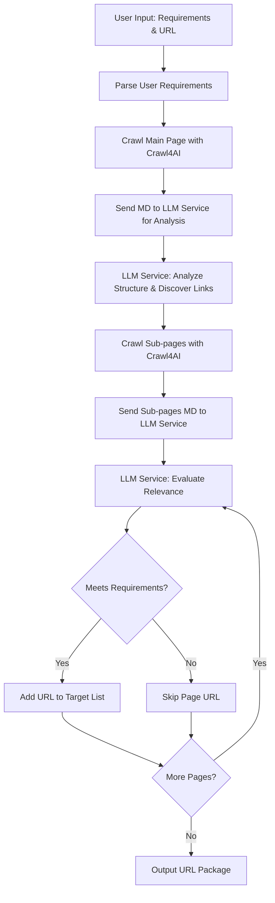
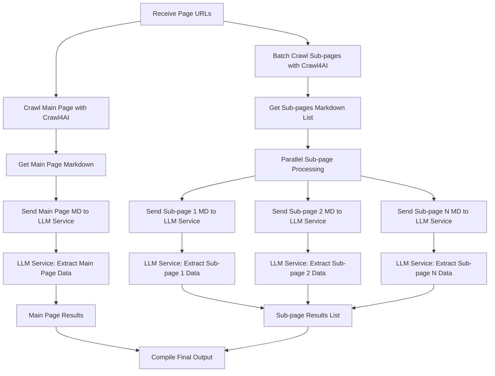
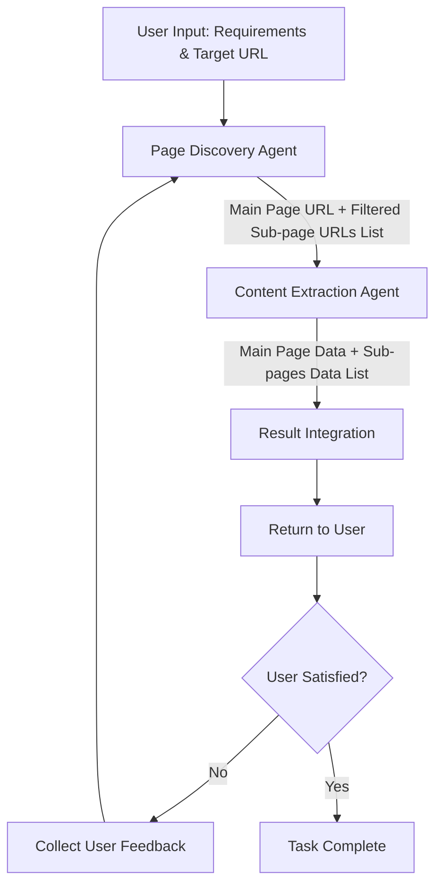
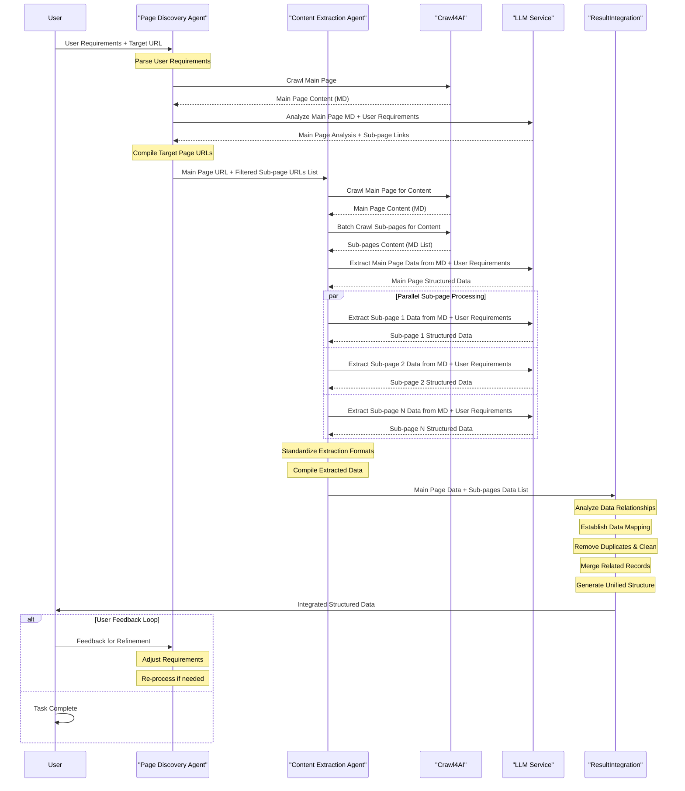

# Extractra - Product Requirements Document

## 1. Product Overview

### 1.1 Product Vision
Build an intelligent multi-agent system that can automatically discover, extract, and integrate web data based on user requirements and target website URLs.

### 1.2 Product Goals
- Automate the complex process of web data extraction
- Provide intelligent page discovery and content filtering
- Deliver structured, clean, and integrated data outputs
- Support iterative refinement based on user feedback

### 1.3 Target Users
- Data analysts and researchers
- Business intelligence teams
- Market research professionals
- Content aggregation services
- Academic researchers

## 2. System Architecture

### 2.1 High-Level Architecture
The system consists of three core agents working with LLM Service and Crawl4AI Service:

```
User Input → Page Discovery Agent ↔ LLM Service
                ↓                    ↑
          Content Extraction Agent ↔ Crawl4AI Service
                ↓
        Result Integration Agent → User Output
```

### 2.2 Core Components

#### 2.2.1 Page Discovery Agent
**Purpose**: Orchestrate the discovery and filtering of relevant page links from target websites

**Key Responsibilities**:
- Parse user extraction requirements
- Coordinate with Crawl4AI to get page content in Markdown format
- Leverage LLM Service to analyze page content and discover sub-page links
- Use LLM Service to evaluate page relevance against user requirements
- Compile target page URL list (main page + filtered sub-pages)

**Input**: User requirements + Target website URL
**Output**: Main page URL + Filtered sub-page URLs list

#### 2.2.2 Content Extraction Agent
**Purpose**: Orchestrate the extraction of structured data from discovered pages

**Key Responsibilities**:
- Receive main page URL and sub-page URLs list from Page Discovery Agent
- Coordinate with Crawl4AI to get all page content in Markdown format
- Leverage LLM Service to extract relevant data based on user requirements
- Parallel processing of sub-page content extraction via LLM Service
- Standardize extraction formats across all pages
- Compile extracted data into structured format

**Input**: Main page URL + Sub-page URLs list
**Output**: Main page data + Sub-pages data list

#### 2.2.3 LLM Service
**Purpose**: Provide intelligent analysis and content processing capabilities

**Key Responsibilities**:
- Analyze Markdown content to understand page structure and discover links
- Evaluate page relevance against user requirements
- Extract structured data from Markdown content based on user needs
- Provide intelligent content filtering and classification
- Handle complex reasoning tasks for data extraction and analysis

**Input**: Markdown content + User requirements + Analysis instructions
**Output**: Analysis results + Structured data + Relevance scores

#### 2.2.4 Crawl4AI Service
**Purpose**: Provide web crawling and content conversion capabilities

**Key Responsibilities**:
- Crawl web pages and convert to clean Markdown format
- Handle various web page formats and structures
- Provide efficient batch crawling capabilities
- Ensure consistent content formatting across different pages

**Input**: URLs list
**Output**: Markdown content list

#### 2.2.5 Result Integration Agent
**Purpose**: Integrate and clean extracted data

**Key Responsibilities**:
- Analyze data relationships between main page and sub-pages
- Establish data mapping and connections
- Remove duplicates and clean data
- Handle data conflicts and anomalies
- Merge related data records
- Generate unified data structure
- Validate data quality
- Produce final dataset

**Input**: Main page data + Sub-pages data list
**Output**: Integrated structured data

## 3. Detailed Workflow

### 3.1 Page Discovery Agent Workflow



### 3.2 Content Extraction Agent Workflow


## 4. Key Features

### 4.1 Intelligent Page Discovery
- Automated website structure analysis
- Smart sub-page link discovery and filtering
- Content relevance evaluation without full content extraction
- Efficient URL compilation and organization

### 4.2 Centralized Content Extraction
- Unified content crawling and extraction process
- Concurrent processing of multiple pages
- Standardized data extraction formats
- Error handling and retry mechanisms

### 4.3 Advanced Data Integration
- Cross-page data relationship analysis
- Intelligent duplicate detection and removal
- Data conflict resolution
- Quality validation and verification

### 4.4 User Feedback Loop
- User satisfaction assessment
- Feedback collection and processing
- Iterative refinement capability
- Requirement adjustment support

## 5. Technical Requirements

### 5.1 Core Technologies
- **LLM Service**: Intelligent analysis, content understanding, and data extraction
- **Crawl4AI**: Web crawling and Markdown content conversion
- **Markdown Processing**: Content standardization and format handling
- **Parallel Processing**: Concurrent page processing capabilities
- **Data Integration**: Advanced data merging and cleaning algorithms

### 5.2 Performance Requirements
- Support for large-scale website crawling
- Efficient parallel processing of multiple pages
- Real-time feedback and adjustment capabilities
- Scalable architecture for growing data volumes

### 5.3 Data Quality Requirements
- Accurate content extraction with minimal errors
- Comprehensive duplicate detection and removal
- Robust conflict resolution mechanisms
- Data integrity validation

## 6. User Journey

### Primary User Journey
1. **Input Phase**: User provides requirements and target URL
2. **Discovery Phase**: System discovers and filters relevant page URLs
3. **Extraction Phase**: System crawls and extracts structured data from all pages
4. **Integration Phase**: System cleans and integrates all data
5. **Output Phase**: System delivers final structured dataset
6. **Feedback Phase**: User reviews and provides feedback if needed
7. **Refinement Phase**: System adjusts based on feedback (if required)

### Workflow


### Flow Diagram
